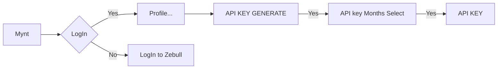

# Introduction

> Source: <https://zebumyntapi.web.app/Base/>

Base URL

The BASE URL is the common url used as prefix for all API call.

Base URL - https://go.mynt.in

Get API KEY

- Login to MYNT WEB application.
- Navigate to Profile → ClientId.
- Users can generate "API key" via the API Key button.
- Then Select the generate "API key" → month and click the Generate API Key button.
- Finally the MYNT API key is generate.

### Login

1. Enter Client code --> User ID
2. Enter Password
3. DOB/PAN/OTP/TOTP

### Profile

- Click on the the  Profile → Client code button in right top in nav bar.

### API KEY GENERATE

*Click the API key button next to the logout put for generate.

- Select the API key Months
   
- Generate the API Key

### API KEY

MYNT Connect is a collection of REST-like HTTP APIs that offer many of the capabilities needed to create a full-featured stock market trading and investment platform. You can manage user portfolios, broadcast real-time market data using WebSockets, execute orders in real-time (for stocks, commodities, mutual funds), and more.
